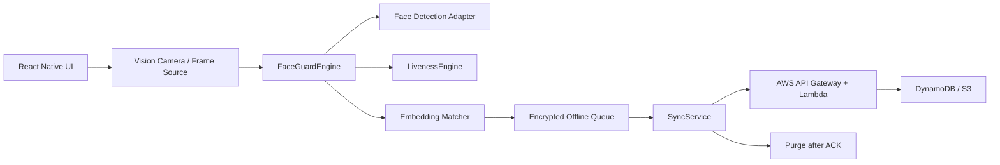

# FaceGuard Technical Design

## Objective

Build a lightweight, offline-first facial recognition and liveness detection module that can be integrated into the Datalake 3.0 React Native app for remote field operations.

## Architecture



## Authentication Flow

1. Capture a short frame sequence from the front camera.
2. Detect face and key landmarks.
3. Reject low-light or no-face frames.
4. Run passive texture liveness score.
5. Run randomized active liveness checks: blink, head turn, smile.
6. Generate a 512-dimensional face embedding.
7. Match with enrolled local embeddings using cosine similarity.
8. Store the signed result in an encrypted SQLite queue.
9. Sync only when connectivity returns.
10. Purge local biometric payload after server acknowledgement.

## Model Plan

| Model | Planned Architecture | Format | Target Size | Purpose |
| --- | --- | --- | --- | --- |
| BlazeFace | MobileNetV1 single-shot detector | INT8 TFLite | 1.5 MB | Face box and landmarks |
| MobileFaceNet | Depthwise separable CNN | FP16 TFLite | 5 MB | Face embedding |
| Anti-spoof CNN | Lightweight texture classifier | INT8 TFLite | 3 MB | Photo/screen artifact detection |

Total planned model and runtime footprint: about 14.5 MB.

## Liveness Logic

Active liveness requires at least two of three checks:

- Blink: eye aspect ratio drops under the configured threshold.
- Head turn: nose position shifts relative to the eye line across frames.
- Smile: mouth width-to-height ratio crosses the smile threshold.

Passive liveness checks texture quality to catch printed photos and screen replays. Challenge order should be randomized in production to reduce replay attacks.

## Local Storage

`OfflineQueue` stores pending authentication events in SQLite. The payload is protected with a SecureStore-backed device key in the prototype. Production builds should replace the lightweight prototype envelope with AES-GCM from the platform keystore or a reviewed native crypto module.

## Sync And Purge

`SyncService` checks connectivity, uploads pending records, waits for server acknowledgement, zero-fills the payload field, then deletes acknowledged rows. Failed sync attempts remain in the queue with retry metadata.

## Benchmarks

Target profile from the supplied PPT:

| Stage | Target |
| --- | ---: |
| Camera frame capture | 16 ms |
| Face detection | 25 ms |
| Alignment and crop | 8 ms |
| Texture liveness | 12 ms |
| Embedding generation | 180 ms |
| Similarity match | 5 ms |
| Active liveness | 500 ms |
| Total | 750 ms |

Run the local benchmark:

```bash
npm run benchmark
```

Real benchmark evidence must be collected on at least one Android 8+ mid-range device and one iOS 12+ device after real TFLite adapters are connected.

## Security Boundaries

- Biometric matching is local-first.
- Raw frames are not persisted.
- Embeddings should be encrypted if stored for enrollment.
- Server upload happens only over HTTPS.
- Purge requires an acknowledgement token.
- Production should add device attestation and signed model manifests.

## Known Prototype Limits

- The included adapter simulates TFLite inference for demonstrability.
- The sample identity is synthetic.
- The crypto wrapper is intentionally simple for a hackathon prototype and should be replaced with audited AES-GCM before production deployment.
